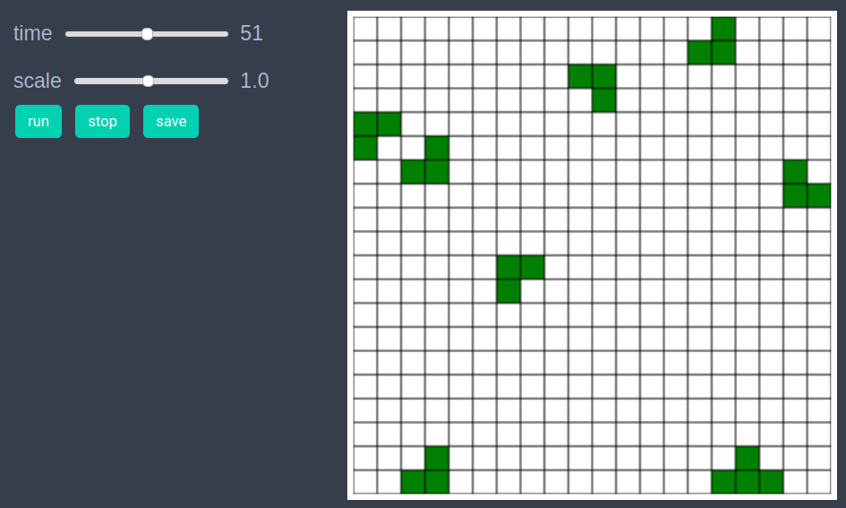
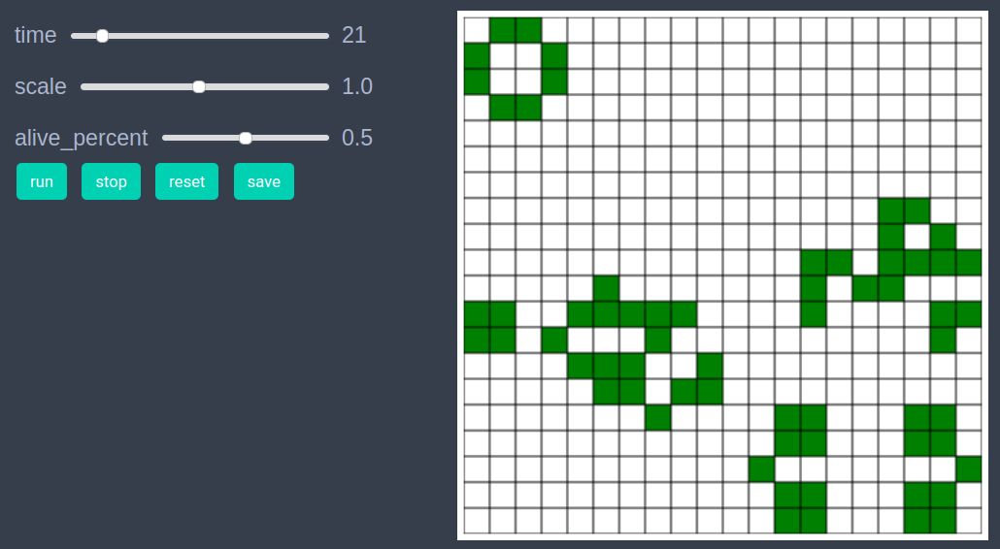
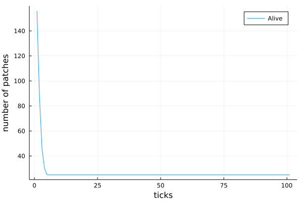

# Conway's Game of Life

```julia
using EasyABM
```

## Step 1: Create Agents and Model

We work with only patches in this model. The size of the 
grid in the model created is 20x20 and `alive_percent` is the fraction of patches that are live initially.

```julia
model = create_2d_model(size = (20,20), alive_percent = 0.4)
```

## Step 2: Initialise the model

In the second step we initialise the patches by defining `initialiser!` function and sending it as an argument to `init_model!`. In the `initialiser!` function we randomly set patches to be either of color `:green` or `:white`. The patches with green color have their 
`is_alive` property set to true and the patches with white color have their `is_alive` property set to false. We specify the patch properties
`color` and `is_alive` that we want to be recorded during time evolution in the `props_to_record` argument to the `init_model!` function.

```julia
function initialiser!(model)
    for j in 1:model.size[2]
        for i in 1:model.size[1]
            if rand()<model.parameters.alive_percent
                model.patches[i,j].color = :green
                model.patches[i,j].is_alive = true
            else
                model.patches[i,j].color = :white
                model.patches[i,j].is_alive = false
            end
        end
    end
end

init_model!(model, initialiser = initialiser!, 
    props_to_record=Dict("patches"=>[:color, :is_alive]))
```

## Step 3: Run the model

In this step we implement the step logic of the Conway's Game of Life in the `step_rule!` function and run the model for 100 steps. 
Since Conway's model requires all patches to be updated at the same time, in the `step_rule!` function we first compute the `is_alive` 
property for all patches and then apply it to patches.


```julia
function calculate_vals(model)
    vals = [false for i in 1:model.size[1], j in 1:model.size[2]]
    for j in 1:model.size[2]
        for i in 1:model.size[1]
            patch = model.patches[i,j]
            nbrs = neighbor_patches((i,j), model, 1)
            num_alive = 0
            for nbr in nbrs
                num_alive+= model.patches[nbr...].is_alive
            end
            condition1 = patch.is_alive && ((num_alive == 2) || (num_alive == 3))
            condition2 = patch.is_alive && (num_alive == 3)
            if condition1 || condition2
                vals[i,j] = true
            end
        end
    end
    return vals
end

function apply_vals!(model, vals)
    for j in 1:model.size[2]
        for i in 1:model.size[1]
            is_alive = vals[i,j]
            model.patches[i,j].is_alive = is_alive
            model.patches[i,j].color = is_alive ? :green : :white
        end
    end       
end


function step_rule!(model)
    vals = calculate_vals(model)
    apply_vals!(model, vals)
end

run_model!(model, steps=100, step_rule = step_rule! )
```

If one wants to see the animation of the model run, it can be done as 

```julia
animate_sim(model, show_grid=true)
```




After defining the `step_rule!` function we can also choose to create an interactive application (which currently works in Jupyter with WebIO installation) as 

```julia
create_interactive_app(model, initialiser= initialiser!,
    step_rule= step_rule!,
    model_controls=[
        (:alive_percent, :s, 0:0.01:1.0)
        ], 
    frames=200, show_grid=true) 
```




## Step 4: Fetch Data 

We can fetch the data of number alive patches as follows. 

```julia
df = get_nums_patches(model, patch-> patch.is_alive, labels=["Alive"], 
    plot_result = true)
```




